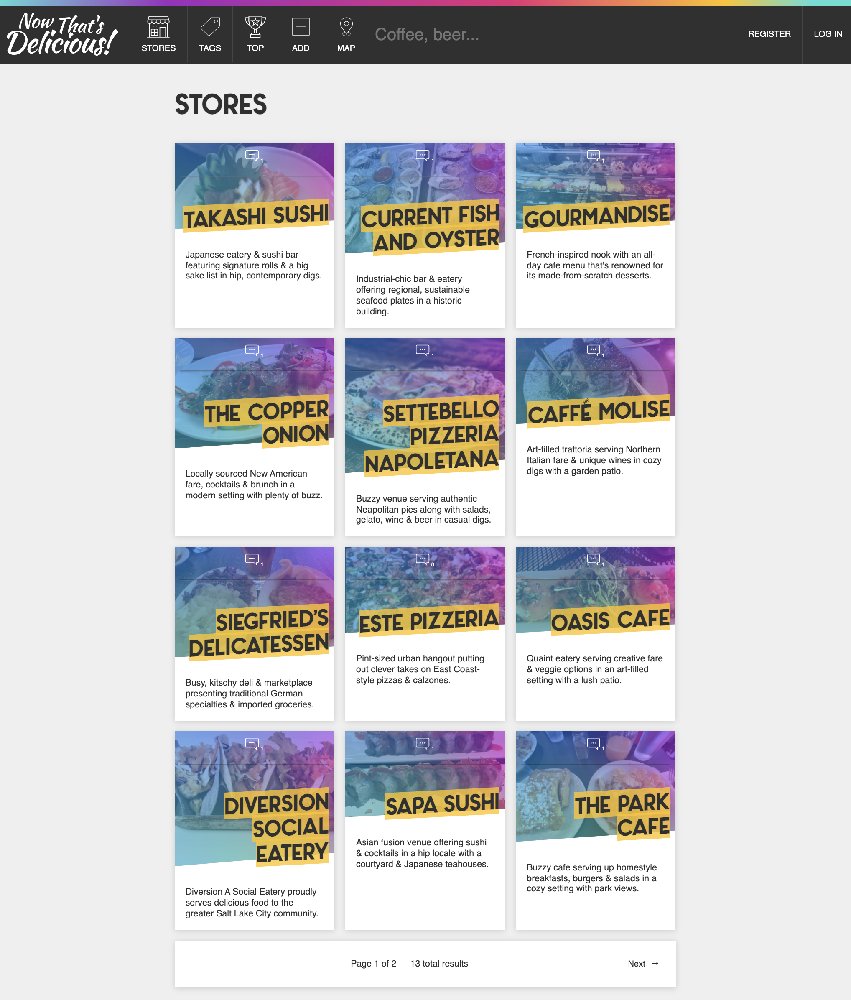
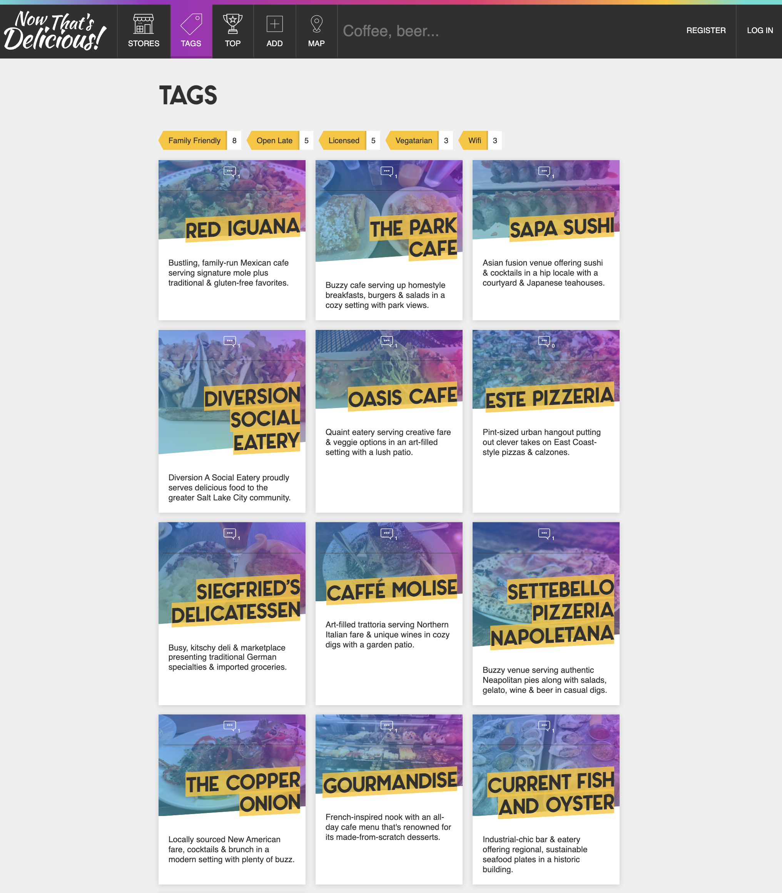
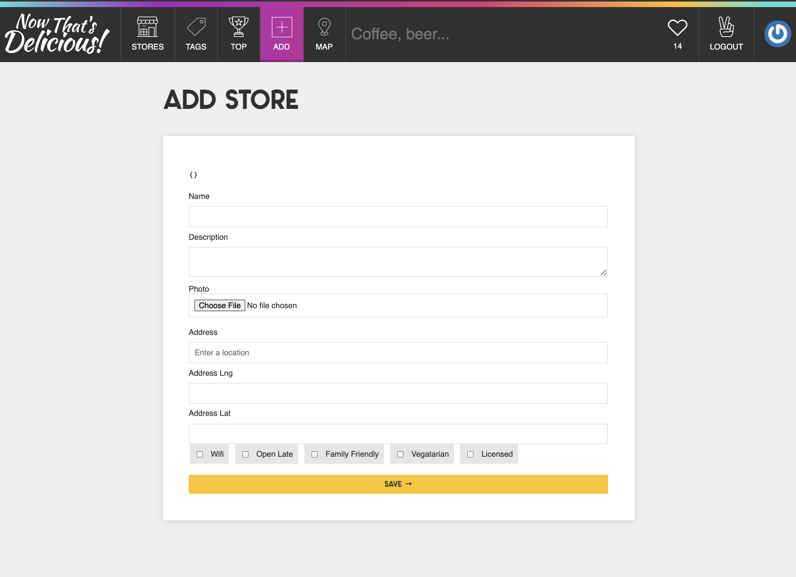
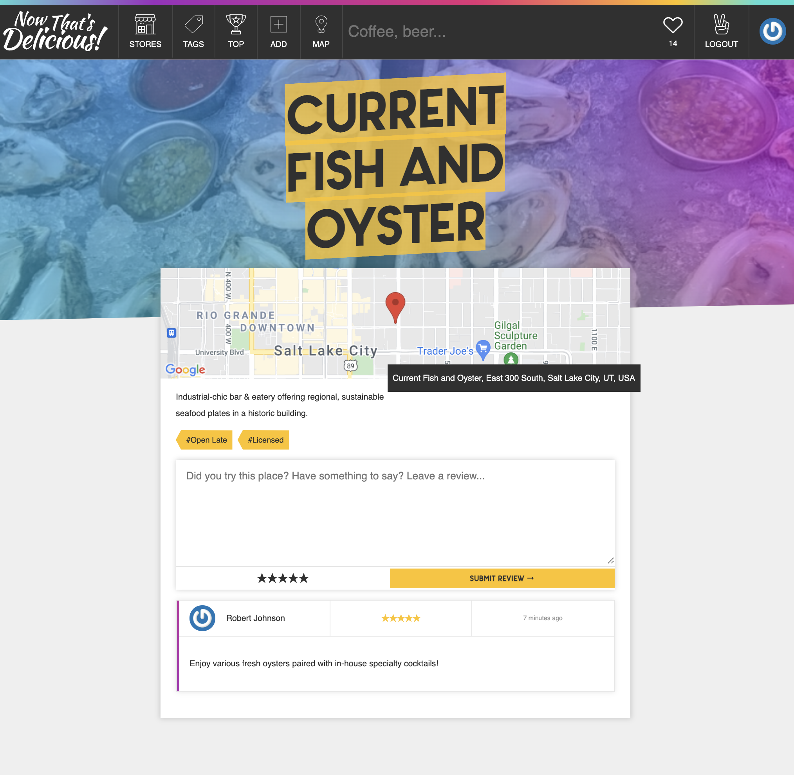
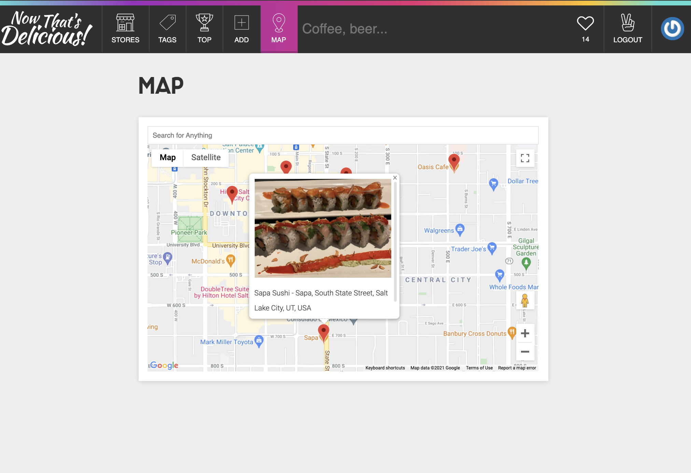

<h1 align="center"><a style="color:purple" href="https://now-thats-delicious-app.herokuapp.com/">Now That's Delicious! 😋 </a></h1>

## Description

Now That's Delicious - Nifty Real World Restaurant App (Search, Geolocate, Review and Curate) features a JavaScript (ES6) frontend with Express.js, Node.js and a MongoDB backend. The app utilizes Passport Auth, Geolocation, Image uploading and resizing. Deployed to Vercel

[](https://github.com/johnsonr84)
[](https://github.com/johnsonr84/now-thats-delicious)
[](https://github.com/johnsonr84/now-thats-delicious)
[](https://choosealicense.com/licenses/mit/)

## Built With

[](https://nodejs.org/en/)
[](https://www.javascript.com/)
[](https://www.mongodb.com/)
[](https://expressjs.com/)
[](https://sass-lang.com/)
[](https://www.heroku.com/)

## Table of Contents

- [Description](#Description)
- [Outcome](#Outcome)
- [Project URL](#Project-URL)
- [Deployment](#Deployment)
- [Demo/Screenshots](#Demo/Screenshots)
- [Technologies](#Technologies)
- [Installation](#Installation)
- [Credits](#Credits)
- [License](#License)
- [Resources](#Resources)
- [Contact](#Contact)
- [Author](#Author)

## Outcome

- It is responsive to different screen sizes of devices such as mobile, tablet, and desktop.

## Project URL

https://github.com/johnsonr84/now-thats-delicious

## Deployment

https://now-thats-delicious-app.herokuapp.com/

## Demo/Screenshots

  <table>
    <tr>
      <td>Now That's Delicious Stores Page</td>
    </tr>
    <tr>
      <td></td>
    </tr>
     <tr>
      <td>Now That's Delicious Tags Page</td>
    </tr>
    <tr>
      <td></td>
    </tr>
     <tr>
      <td>Now That's Delicious Add Stores Page</td>
    </tr>
    <tr>
      <td></td>
    </tr>
    <tr>
      <td>Now That's Delicious Store Review Example</td>
    </tr>
    <tr>
      <td></td>
    </tr>
     <tr>
      <td>Now That's Delicious Map Page</td>
    </tr>
    <tr>
      <td></td>
    </tr>
  </table>

## Technologies

```
Node.js, JavaScript, Express.js, MongoDB, Auth, Passport, Geolocation, Image Uploading and Resizing, SASS
```

## Installation

- Access to GitHub.com and a code editor such as vscode is necessary
- Go to [https://github.com/johnsonr84/now-thats-delicious](https://github.com/johnsonr84/now-thats-delicious)
- Click on the green button that says Clone or Download
- Choose how you would like to download: using the SSH/HTTPS keys or download the zip file
- Using SSH/HTTPS Key: You will copy the link shown and open up either terminal (mac: pre-installed) or gitbash (pc: must be installed). Once the application is open, you will type git clone paste url here. Once you have cloned the git repo, cd into the repo and type open. to open the folder which contains all files used for the website. Once inside the folder, click on index.html to open the website in the browser.
- Using Download ZIP: Click on Download Zip. Locate the file and double click it to unzip the file. Locate the unzipped folder and open it. All the files for the website will be within this folder. Click on index.html to open the website in the browser.

## Credits

I would like to credit Wes Bos's Learn Node.js Course for teaching me the skills necessary to complete this wonderful project and to improve my understanding of Node within a fullstack project.

## License

This project is [mit](https://choosealicense.com/licenses/mit/) licensed.

## Resources

- [Choose a License](https://choosealicense.com/)
- [Badmath](https://img.shields.io/github/languages/top/nielsenjared/badmath)
- [shields.io](https://shields.io/)
- [Learn Node!](https://learnnode.com/)

## Contact

Email: robertcjohnson1984@gmail.com

## Author

Author(s): Rob Johnson  
 GitHub: https://github.com/johnsonr84/
